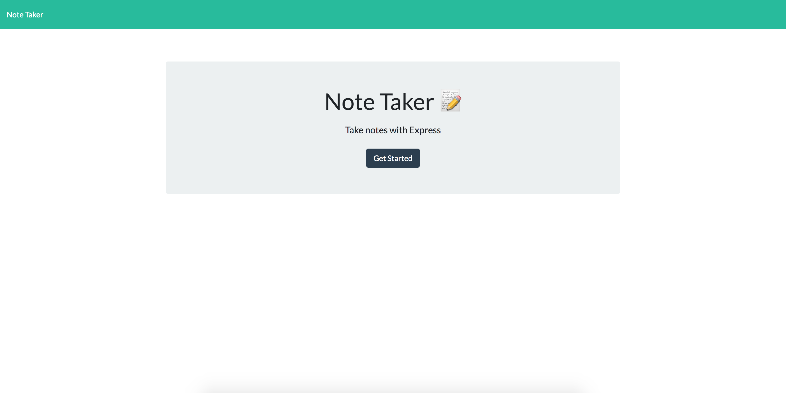

# note-taker
# Team Profile Generator
  ## Description  
  Note Taker is an application which is used to keep track of important information with this Note Taker tool. User can create, view, and remove different notes with titles and content. .

  ## Table Of Content  
  * [Installation](#installation)
  * [Usage](#usage)
  * [Screenshots](#screeshots)
  * [Contributor](#contributor)
  * [Questions](#questions)

  ## Installation  
  To install dependencies run this command 

  ```npm install express``` AND  ```npm install uniqid``` for creating unique id for single note

  ## Usage  
  User can keep track of a lot information either they use it for personal or professional level.

  ## License  
    None

## Screenshots
### Home Page
  
### List of All Notes
  
### One Selected Note 
  
### Deleted 'Dinner' from the Notes
  
  
  ## Technologies

    Node.js
    NPM
    uniqid package
    HTML
    Bootstrap
  ## Contributor  
  Mehak Zehra ♥
  ## Questions  
  - - -
  For questions about this project, please see my GitHub at [mehak-zehra](https://github.com/mehak-zehra)  (Or) 

  Contact me at mehak.rizvi.786@gmail.com